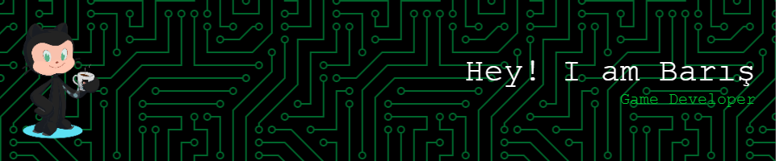

<h1 align="center">Hi 👋, I'm Barış Gürbüz</h1>
<h3 align="center">A passionate game developer from Turkey</h3>

- 👩🏼‍💻 I'm currently a student at **IZTECH Computer Engineering**

- 🌱 I’m currently learning **Unreal Engine 5**

- 📫 How to reach me **barisgurbuz15@gmail.com**

<h3 align="left">Connect with me:</h3>

<h3 align="left">Languages and Tools:</h3>

         

